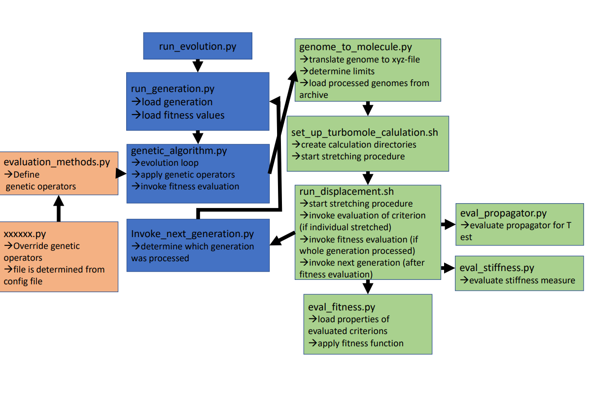
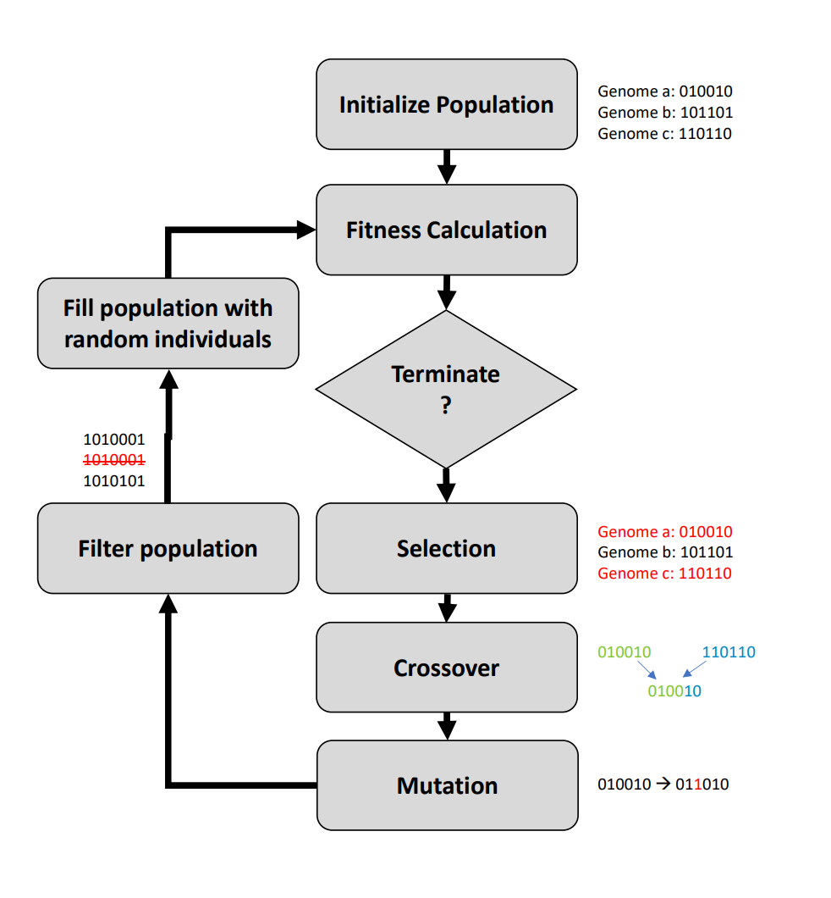

Genetic Algorithm
==============
This code is part of "Designing Mechanosensitive Molecules from Building Blocks: A Genetic Algorithm-Based
Approach"

# TOC
* [Requirements](#Requirements)
* [Usage](#Usage)
  * [Preparation](#Preparation)
  * [Config file](#Config file)
  * [Flow Chart](#Flow Chart)
  * [Evolution](#Evolution)
* [Standalone evaluation of molecules](#Standalone evaluation of molecules)
* [Stretching for molecules build from building blocks](#Stretching for molecules build from building blocks)
* [Stretching for arbitrary isolated molecules](#Stretching for arbitrary isolated molecules)
* [Analysis for full transport calculations](#Analysis for full transport calculations)
  * [Breaking Analysis](#Breaking Analysis)

Requirements
------------
* tmoutproc library from  [here](https://github.com/blaschma/tmoutproc). Tested with version 0.1
* Queuing system slurm or GE
* Python 3.x
* [Turbomole](https://www.turbomole.org/). Version >7.5
# Usage
## Preparation
* Create directory where the evulution runs
  * Generate directory "generation_data" in it
  * Create config file (see next part)
  * Run evolution: python3 PATH_TO_CODE/genetic/run_evolution.py <config_path> <calculation_path>  
## Config file
(With exemplary values. Adjust that to your calculations)
````
[Basics]
genetic_algorithm_path=PATH TO GENETIC ALGORITHM 
turbopath=PATH TO TURBOMOLE
helper_files=PATH TO HELPER FILES
intel_path=PATH TO INTEL Routines
archive_archive_path=PATH TO ARCHIVE OF MOLECULES
calculation_path=PATH TO CURRENT CALCULATION
queuing=(SLURM or GE)

[Genetic Algorithm]
population_size=24
generation_limit=20
evaluation_methods_path=default
genome_length=7
insert_mutation_prob=0.5
coupling_mutation_prob=0.5
block_mutation_prob=0.5
truncate_mutation_prob=0.5

[Building Procedure]
CC_bond_lengt=1.58
conjugation_angle=0.45
building_block_path=
generation_data_path=generation_data
ang2Bohr=1.889725989
har2Ev=27.211

[Turbomole Calculations]
partition=epyc,alcc1
cpus_per_task=8
displacement_per_step=0.1
num_stretching_steps_pos=30
num_stretching_steps_neg=30
mem_per_cpu=15G
max_time=05:30:00
kill_time=5700
relax_level=xtb
relax_iterations=730
prerelax= #T or false
define_input=build_calc
````

## Flow Chart
Overview of program sequence:


## Evolution
Evolution loop implemented in the algorithm:


# Standalone evaluation of molecules
## Stretching for molecules build from building blocks
Insert instructions here
## Stretching for arbitrary isolated molecules
Insert instructions here

## Analysis for full transport calculations
Some scripts can be used for the evaluation of full transport and stretching traces. Since the code was developed for the genetic algorithm, the usage is sometimes quite cumbersome. 
### Breaking Analysis
breaking_ana.py can be used to evaluate the force in full transport calculation (with ECC):
* Prepare total energy file: 
  * cd to disp_pos or disp_neg directory
  * . eval_stiffness.sh <DIRECTORY_TO_PROCESS> <FILENAME> <config_file>
  * <DIRECTORY_TO_PROCESS>: Where disp_pos and disp_neg are located
  * FILENAME: Prefix of generated file generation_individual (-> Important for breaking analysis)
  * <config_file> Not needed for standalone evaluation
* Run breaking analysis: python3 <DIRECTORY_TO_PROCESS> <generation> <individual>
  * <DIRECTORY_TO_PROCESS>: Where disp_pos and disp_neg are located
  * generation: Generation for energy file
  * individual: Individual for energy file -> generation_individual_totalEnergy.dat


***
Matthias Blaschke [matthias.blaschke@physik.uni-augsburg.de](matthias.blaschke@pyhsik.uni-augsburg.de)