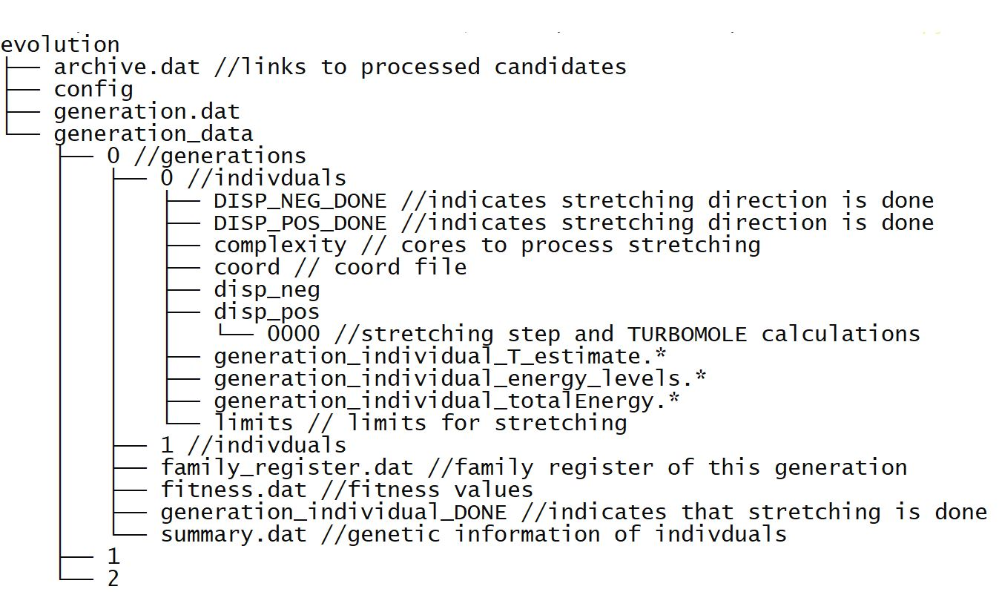

Genetic Algorithm
==============
This code is part of "Designing Mechanosensitive Molecules from Building Blocks: A Genetic Algorithm-Based
Approach"

# TOC
* [Requirements](#Requirements)
* [Usage](#Usage)
  * [Preparation](#Preparation)
  * [Config file](#Config file)
  * [Flow Chart](#Flow Chart)
  * [Evolution](#Evolution)
* [Standalone evaluation of molecules](#Standalone evaluation of molecules)
* [Stretching for molecules build from building blocks](#Stretching for molecules build from building blocks)
* [Stretching for arbitrary isolated molecules](#Stretching for arbitrary isolated molecules)

Requirements
------------
* tmoutproc library from  [here](https://github.com/blaschma/tmoutproc). Tested with version 0.1
* Queuing system slurm or GE
* Python 3.x
* [Turbomole](https://www.turbomole.org/). Version >7.5
# Usage
## Preparation
* Create directory where the evulution runs
  * Generate directory "generation_data" in it
  * Create config file (see next part)
  * Run evolution: python3 PATH_TO_CODE/genetic/run_evolution.py <config_path> <calculation_path>  
## Config file
(With exemplary values. Adjust that to your calculations)
````
[Basics]
genetic_algorithm_path=PATH TO GENETIC ALGORITHM 
turbopath=PATH TO TURBOMOLE
helper_files=PATH TO HELPER FILES
intel_path=PATH TO INTEL Routines
archive_archive_path=PATH TO ARCHIVE OF MOLECULES
calculation_path=PATH TO CURRENT CALCULATION
queuing=(SLURM or GE)

[Genetic Algorithm]
population_size=24
generation_limit=20
evaluation_methods_path=default
genome_length=7
insert_mutation_prob=0.5
coupling_mutation_prob=0.5
block_mutation_prob=0.5
truncate_mutation_prob=0.5
n_tournament_selection=2

[Building Procedure]
CC_bond_lengt=1.58
conjugation_angle=0.45
building_block_path=
generation_data_path=generation_data
ang2Bohr=1.889725989
har2Ev=27.211

[Turbomole Calculations]
partition=epyc,alcc1
cpus_per_task=8
displacement_per_step=0.1
num_stretching_steps_pos=30
num_stretching_steps_neg=30
mem_per_cpu=15G
max_time=05:30:00
kill_time=5700
relax_level=xtb
relax_iterations=730
prerelax= #T or false
define_input=build_calc
````

## Flow Chart
Overview of program sequence:

The programm will create a folder structure similar to this:



## Evolution
Evolution loop implemented in the algorithm:


## Standalone evaluation of molecules
### Stretching for molecules build from building blocks
You can bypass the evolution and evaluate molecules directly build from building blocks by running directly 
genome_to_molecule.py.
### Stretching for arbitrary isolated molecules
You can bypass the evolution and evaluate arbitrary molecules by running directly set_up_turbo_calculations.sh. 
Generate folder structure as shown in the structure above. Place coord, coord.xyz, complexity and limits file, prepare 
config file and rund set_up_turbo_calculations.sh.


***
Matthias Blaschke [matthias.blaschke@physik.uni-augsburg.de](matthias.blaschke@pyhsik.uni-augsburg.de)